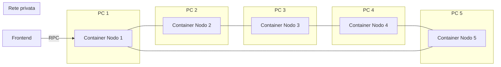

# Piano di sviluppo Backend: blockchain privata e token biglietti

## È possibile?

Sì. L’idea è realizzabile in un hackathon con un team di 5 persone. Si usa una **blockchain privata compatibile con Ethereum** (stessi concetti e strumenti di Ethereum, ma rete isolata e sotto il vostro controllo). Ogni PC avrà **un container** che fa da **nodo** della rete; i **token** (biglietti) e le regole di **acquisto/vendita** sono gestiti da **smart contract** sulla stessa chain.

---

## Concetti base (in breve)

- **Blockchain**: catena di blocchi che registra transazioni. Ogni **nodo** tiene una copia del registro e si accorda con gli altri su quali blocchi sono validi (consenso).
- **Rete privata**: solo i vostri 5 nodi partecipano; non è connessa a Ethereum pubblico.
- **Smart contract**: programma che vive sulla chain; qui gestirà l’emissione dei token e le regole di scambio.
- **Token**: in questo caso rappresentano i “biglietti”. Ogni biglietto può essere un token non fungibile (un token = un biglietto, tipo ERC-721).
- **Wallet**: coppia chiave privata / indirizzo. Chi “rilascia” i biglietti e chi li compra/vende userà un wallet; le transazioni sono firmate con la chiave privata.
- **RPC**: interfaccia (es. HTTP) per leggere lo stato della chain e inviare transazioni. Il frontend (e eventuale API) parlerà con un nodo via RPC.

---

## Architettura high-level

- **5 container** (uno per PC): in ognuno gira un **client Ethereum** (es. Geth o Hyperledger Besu).
- I nodi si **scoprono** e **si connettono** tra loro (lista di peer o bootnode).
- **Consenso**: con 5 nodi si può usare un meccanismo “autorizzato” (solo i 5 nodi validano), ad esempio **Clique** (Geth) o **IBFT 2.0** (Besu).
- **Frontend**: si connette a **un** nodo (es. quello del PC 1) via RPC per leggere blocchi, saldi, eventi e per inviare transazioni (acquisto/vendita token).

---

## Stack tecnico consigliato

| Componente            | Scelta                                        | Motivo                                                                                                                                                                         |
| --------------------- | --------------------------------------------- | ------------------------------------------------------------------------------------------------------------------------------------------------------------------------------ |
| Blockchain            | Geth (Go Ethereum) o Hyperledger Besu         | Entrambi supportano reti private, consenso adatto a pochi nodi, RPC standard. Besu ha IBFT2 “chiavi in mano”.                                                                  |
| Container             | Docker + Docker Compose (per sviluppo locale) | Un `docker-compose` può descrivere i 5 nodi; in hackathon ogni persona può lanciare il “proprio” nodo da uno stesso Compose o da script che si connettono agli altri.          |
| Smart contract        | Solidity                                      | Standard per Ethereum; molti tutorial e librerie (OpenZeppelin) per token e marketplace.                                                                                       |
| Tooling contract      | Brownie                                       | Compilazione, test in Python, deploy da script; integrazione con rete locale/privata.                                                                                                    |
| “Backend” applicativo | Opzionale: Python/FastAPI (o Flask)         | Se serve un’API REST che legge dalla chain (es. “ultimi blocchi”, “lista biglietti in vendita”) o che fornisce configurazione (endpoint RPC, indirizzo contratto) al frontend. |

Per “BE che permette di tirare su la blockchain” intendo:

1. **Infrastruttura chain**: configurazione della rete (genesis, nodi, connettività).
2. **Deploy e script**: compilazione e deploy degli smart contract sulla rete.
3. **Eventuale API**: piccolo servizio che il frontend può usare per leggere dati dalla chain (se non volete che il FE parli solo via Web3 a un nodo).

---

## Fasi di sviluppo Backend

### Fase 1: Ambiente e repository

- **1.1** Creare la struttura del progetto (es. cartelle `blockchain/`, `contracts/`, `backend-api/` se serve).
- **1.2** Documentare requisiti: Docker e Docker Compose installati su ogni PC; Python 3.x per Brownie e eventuale API.
- **1.3** Un README con: come clonare il repo, come avviare i 5 nodi (vedi sotto), come esporre la porta RPC di un nodo per il FE.

Nessuna nozione di blockchain richiesta qui: solo “avviare 5 container e avere un endpoint RPC”.

---

### Fase 2: Configurare la rete privata (5 nodi)

- **2.1 Genesis block**  
File di “genesis” che definisce la chain (nome, id di rete, algoritmo di consenso, blocchi iniziali). Per **Clique** (Geth) si specificano gli indirizzi “sealer”; per **IBFT 2.0** (Besu) i validatori. Tutti e 5 i nodi devono usare **lo stesso file genesis**.
- **2.2 Chiavi e indirizzi**  
Ogni nodo ha un’identità (chiave privata del nodo). Per il consenso autorizzato servono le chiavi (o gli indirizzi) dei 5 validatori. Generare le chiavi in modo deterministico (es. script) e metterle in secret/volume dedicati per container; **non** committare chiavi private nel repo.
- **2.3 Immagine Docker**  
Un’immagine che installa Geth (o Besu) e che all’avvio:
  - usa il genesis condiviso;
  - avvia il nodo in modalità “private network”;
  - espone la porta RPC (es. 8545) e la porta P2P (es. 30303) per la scoperta tra nodi.
- **2.4 Connessione tra i 5 PC**  
In hackathon i 5 PC sono spesso sulla stessa LAN. Opzioni:
  - **Stesso host**: un solo `docker-compose` con 5 servizi (nodo1…nodo5); utile per test.
  - **5 host diversi**: ogni PC avvia un container; bisogna che i nodi si trovino tramite **IP:porta P2P** (o un bootnode). Configurare ogni container con la lista degli altri peer (es. variabili d’ambiente o file di configurazione) e aprire la porta P2P sulla LAN.
- **2.5 Documentazione**  
Istruzioni passo-passo: “Sul PC 1 lancia questo comando; sul PC 2 questo; …”. Includere come verificare che i nodi siano connessi (es. `admin.peers` via RPC o strumenti della console).

Questa fase è quella che “tira su” la blockchain; una volta stabile, non la tocchi spesso.

---

### Fase 3: Smart contract per i token (biglietti)

- **3.1 Tipo di token**  
I “biglietti” sono tipicamente **non fungibili** (un token = un biglietto con un suo ID). Standard **ERC-721** (NFT). L’**ente** che rilascia i biglietti sarà il “proprietario” del contratto e potrà **mintare** (creare) token.
- **3.2 Contratto ERC-721**  
Usare OpenZeppelin (`@openzeppelin/contracts`) e estendere `ERC721` (e magari `ERC721Enumerable` per “lista di tutti i token”). Funzioni principali:
  - `mint(to, tokenId)` (solo owner): crea un biglietto e lo assegna a `to`.
  - Eventi standard `Transfer` per far vedere al frontend acquisti e trasferimenti.
- **3.3 Contratto “Marketplace” (compravendita)**  
Un secondo contratto che:
  - permette a chi possiede un token di **metterlo in vendita** (listing: prezzo, tokenId);
  - permette a chiunque di **acquistare** pagando il prezzo in ether della chain (o in un token ERC-20 se preferite); alla conferma, il contratto trasferisce il token dal venditore al compratore e il pagamento al venditore.
  - eventi tipo `Listed(tokenId, price)`, `Sold(tokenId, buyer, price)` per il FE.
- **3.4 Test**  
Con Brownie, scrivere test in Python che: deploy su rete locale Brownie, mint di alcuni token, listing e acquisto. Così verificate la logica senza toccare i 5 nodi.

Questa fase realizza “creazione e scambio di token” sulla chain.

---

### Fase 4: Deploy sulla rete privata

- **4.1 Configurazione Brownie**  
Aggiungere in `brownie-config.yaml (o network.yaml)` una rete tipo `private` con `url: "http://IP_PC1:8545"` (o l’RPC del nodo a cui avete accesso) e `chainId` uguale a quello del genesis.
- **4.2 Script di deploy**  
Script Python che: deploy del contratto ERC-721, deploy del Marketplace (passando l’indirizzo del token), eventuale mint iniziale per l’ente. Salvare gli **indirizzi dei contratti** e il **ABI** in file (es. JSON) che il frontend (e l’eventuale API) useranno.
- **4.3 Wallet dell’ente**  
L’“ente” che emette i biglietti deve essere un wallet (chiave privata) con cui firmate le transazioni di mint. Creare un wallet dedicato, finanziarlo con ether sulla chain privata (pre-minato nel genesis o trasferito da un altro account), e usarlo negli script di deploy e mint.
- **4.4 Documentazione**  
Istruzioni: “Dopo aver avviato i 5 nodi, eseguite `brownie run scripts/deploy.py --network private` da un solo PC; tenete salvati indirizzo contratto token e marketplace”.

---

### Fase 5: Backend API (opzionale ma utile per il FE)

- **5.1 Ruolo**  
Un piccolo servizio (es. FastAPI o Flask) che:
  - espone endpoint tipo: “ultimi N blocchi”, “eventi Listed/Sold”, “biglietti di un utente”, “lista biglietti in vendita”.
  - legge dalla chain via web3.py collegandosi all’RPC di un nodo (es. stesso PC dove gira l’API, o un nodo designato).
- **5.2 Implementazione**  
Usare **web3.py** per connettersi all’RPC, leggere eventi (log) e stato dei contratti (balanceOf, getListing, ecc.). Nessuna “blockchain” da programmare: solo chiamate RPC e parsing di eventi.
- **5.3 Configurazione**  
L’API deve conoscere: URL RPC, indirizzi dei contratti token e marketplace, ABI. Tutto in config/env; il FE può anche chiamare l’API per ottenere “config” (indirizzo contratto, chainId) se non volete hardcodare nel frontend.

Questo è il “BE” in senso classico: un server che il frontend usa per visualizzare la chain e le operazioni sui token.

---

### Fase 6: Documentazione e runbook per il team

- **6.1 README**  
  - Cosa fa il progetto (blockchain privata, token biglietti, marketplace).
  - Prerequisiti (Docker, Python 3.x, pip/venv).
  - Come avviare i 5 nodi (scenario “tutti su un PC” e “5 PC separati”).
  - Come deployare i contratti e dove trovare gli indirizzi.
  - Come avviare l’API (se presente) e come il FE si connette (RPC o API).
- **6.2 Glossario**  
Breve glossario (genesis, nodo, RPC, wallet, ERC-721, mint, listing, gas) per chi non ha nozioni tecniche.
- **6.3 Troubleshooting**  
Cosa controllare se i nodi non si vedono (firewall, IP, porta P2P), se le transazioni restano in pending (gas, sealer attivo), se il FE non vede i contratti (chainId, indirizzo contratto, RPC corretto).

---

## Difficoltà stimata e tempi (hackathon)

- **Fase 2 (rete 5 nodi)**: media–alta la prima volta (genesis, P2P tra 5 PC). Consiglio: far funzionare prima **tutti e 5 i nodi su un solo PC** con Docker Compose; poi separare su 5 PC.
- **Fase 3 (contratti)**: media se qualcuno ha già visto Solidity; OpenZeppelin e Brownie riducono molto il lavoro.
- **Fase 4 (deploy)**: bassa una volta che la rete è su.
- **Fase 5 (API)**: bassa con web3.py e FastAPI (o Flask).

Per un hackathon, ordine sensato: **2 (rete locale 5 nodi su 1 PC) → 3 (contratti + test) → 4 (deploy) → 5 (API) → 2b (eventualmente 5 PC separati)**. Il FE che “fa vedere la chain” si appoggia all’RPC e/o all’API di questa BE.

---

## Riepilogo deliverable BE

- Repository con: **genesis**, **Dockerfile e docker-compose** per i 5 nodi, **configurazione Brownie**, **contratti Solidity** (token ERC-721 + marketplace), **script di deploy** (Python), **eventuale API** (Python/FastAPI + web3.py), **README e istruzioni** per il team.  
- La “rete” è proprio **5 container** (uno per PC in produzione hackathon); la “creazione e scambio di token” avviene tramite gli smart contract; il BE espone la chain (e i dati utili) al frontend tramite RPC e, se volete, un’API REST.

Se vuoi, nel passo successivo possiamo entrare nel dettaglio di **un solo** pezzo (es. solo genesis + Docker per Geth, o solo lo schema dei contratti Solidity) con snippet e nomi file concreti.