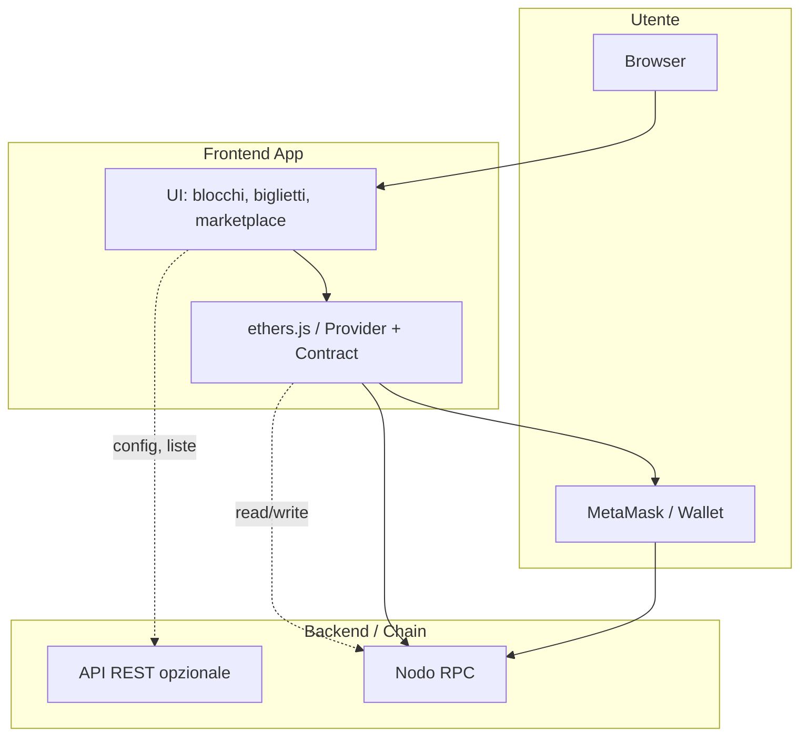

# Piano di sviluppo Frontend: visualizzazione chain e token biglietti

## Obiettivo

Un’applicazione web che:

1. **Mostra la chain**: ultimi blocchi, transazioni, stato della rete.
2. **Permette di usare i biglietti**: vedere i propri token, metterli in vendita, comprare biglietti dal marketplace.
3. Si collega alla **rete privata** e ai **contratti** descritti nel [piano BE](be_blockchain_e_token_e3cce470.plan.md) (RPC di un nodo e, se presente, API REST).

Il frontend non “gestisce” la blockchain: legge dati e invia transazioni tramite **RPC** (e/o API). Le operazioni che modificano lo stato (mint, list, buy) sono **transazioni** firmate dal wallet dell’utente (es. MetaMask).

---

## Concetti utili per il FE

- **Provider**: oggetto (es. ethers.js) che parla con il nodo via RPC (leggere blocchi, saldi, inviare tx). Il FE ne usa uno puntato all’URL del vostro nodo.
- **Wallet connesso**: l’utente “si connette” con MetaMask (o altro wallet): il FE ottiene l’indirizzo e può chiedere di firmare transazioni. Su rete privata bisogna aggiungere la chain in MetaMask (chainId, RPC URL).
- **Contratti nel FE**: con **indirizzo** + **ABI** del contratto si crea un “contratto ethers.js” che espone le funzioni (es. `balanceOf`, `mint`, `list`, `buy`). Le chiamate read sono gratuite; le write diventano transazioni e richiedono la firma del wallet.
- **Eventi**: i contratti emettono eventi (es. `Transfer`, `Listed`, `Sold`). Il FE può ascoltarli per aggiornare la UI (nuovi biglietti, vendite) senza dover fare polling pesante.

---

## Architettura FE




- **UI**: pagine/viste (dashboard chain, “i miei biglietti”, marketplace, dettaglio biglietto).
- **Web3**: inizializzazione provider (RPC URL), connessione wallet, istanze contratto Token e Marketplace (indirizzo + ABI).
- **MetaMask**: scelta per hackathon (familiare, supporto reti custom). L’utente aggiunge la vostra chain (RPC URL + chainId) e si connette; le tx le firma MetaMask.
- **API (opzionale)**: se il BE espone endpoint (ultimi blocchi, biglietti in vendita, config), il FE può usarli per liste e configurazione; le transazioni passano comunque da wallet → RPC.

---

## Stack tecnico consigliato


| Componente    | Scelta                                          | Motivo                                                                                                 |
| ------------- | ----------------------------------------------- | ------------------------------------------------------------------------------------------------------ |
| Framework     | React (con Vite o Create React App)             | Diffuso, molti esempi con ethers.js; Vite veloce per sviluppo.                                         |
| Web3          | ethers.js v6                                    | API chiara, supporto contract, eventi, reti custom.                                                    |
| Wallet        | MetaMask (injected provider)                    | Supporta reti private (aggiunta manuale); `window.ethereum` per connessione.                           |
| Styling       | CSS modules / Tailwind / styled-components      | A scelta; per hackathon va bene anche CSS semplice.                                                    |
| Stato globale | React Context + useState/useReducer (o Zustand) | Per “wallet connesso”, indirizzo, chainId, eventuale cache blocchi/listing. Non serve Redux complesso. |


Alternative: Next.js se volete SSR o API route; Vue/Svelte se il team li preferisce (ethers.js si usa uguale).

---

## Configurazione rete e contratti

- **Config “chain”**: il FE deve conoscere **chainId**, **RPC URL** (es. `http://IP_PC1:8545`), nome della rete (es. “Hackathon Chain”). Questi valori possono venire da env (`.env`) o da un endpoint del BE (es. `GET /config`).
- **Indirizzi contratti**: token (ERC-721) e marketplace. Salvati in config/env o restituiti dall’API; il FE crea le istanze contract con ABI (file JSON generati da Hardhat, committati o serviti dal BE).
- **Aggiunta della chain in MetaMask**: in fase di “connessione” o in una pagina “Setup”, il FE può chiamare `window.ethereum.request({ method: 'wallet_addEthereumChain', params: [{ chainId, rpcUrls, chainName }] })` così l’utente aggiunge la rete con un click (o mostrare istruzioni manuali).

---

## Fasi di sviluppo Frontend

### Fase 1: Progetto e connessione alla chain

- **1.1** Inizializzare progetto (es. `npm create vite@latest fe -- --template react`, poi `npm i ethers`).
- **1.2** Configurare variabili d’ambiente (es. `VITE_RPC_URL`, `VITE_CHAIN_ID`, `VITE_TOKEN_ADDRESS`, `VITE_MARKETPLACE_ADDRESS`). Leggerle con `import.meta.env.VITE_`*.
- **1.3** Creare un modulo “Web3” (es. `src/lib/web3.js`):
  - Provider: `new ethers.JsonRpcProvider(import.meta.env.VITE_RPC_URL)`.
  - Funzione “connetti wallet”: `window.ethereum` → `request({ method: 'eth_requestAccounts' })` e, se serve, `wallet_addEthereumChain` per aggiungere la rete privata.
  - Salvare in context (o stato globale) `address`, `chainId`, `provider` e uno “signer” (per le transazioni): `new ethers.BrowserProvider(window.ethereum)` poi `getSigner()`.
- **1.4** Pagina “Connessione”: pulsante “Connetti wallet”, messaggio se la rete non è quella corretta (“Passa alla Hackathon Chain”), eventuale pulsante “Aggiungi rete”.
- **1.5** Header/Layout: mostrare indirizzo connesso (troncato) e pulsante disconnetti; se nessun wallet, reindirizzare o mostrare CTA per connettersi.

Obiettivo: l’utente apre l’app, si connette con MetaMask alla vostra chain e il FE sa chi è e su quale rete è.

---

### Fase 2: Visualizzazione della chain

- **2.1** Servizio “chain reader”: funzioni che usano il provider (senza wallet) per leggere dati:
  - Ultimo blocco: `provider.getBlockNumber()`.
  - Dettaglio blocco: `provider.getBlock(blockNumber)` (numero, timestamp, numero tx, hash).
  - Transazioni di un blocco: `provider.getBlock(blockNumber, true)` per avere le tx complete, o solo gli hash e eventualmente `provider.getTransaction(txHash)`.
- **2.2** Pagina “Explorer” o “Chain”:
  - Ultimo blocco e lista degli ultimi N blocchi (es. 10–20); per ogni blocco: numero, hash (troncato), timestamp, numero transazioni, link a “dettaglio blocco”.
  - Dettaglio blocco: stesso dati + lista transazioni (hash, from, to, value, status).
  - Opzionale: ricerca per numero blocco o hash tx.
- **2.3** Aggiornamento: polling ogni X secondi su `getBlockNumber()` e refresh della lista; o sottoscrizione `provider.on('block', callback)` se il provider supporta gli eventi (JsonRpcProvider spesso sì).

Obiettivo: “far vedere la chain” con blocchi e transazioni in modo leggibile.

---

### Fase 3: Contratto Token (biglietti) – lettura

- **3.1** Caricare ABI del contratto ERC-721 (da `artifacts/` di Hardhat o da file copiato in `src/abi/`).
- **3.2** Creare istanza contratto: `new ethers.Contract(VITE_TOKEN_ADDRESS, tokenAbi, provider)` per le read; per le write userete lo stesso contratto con lo “signer” (vedi sotto).
- **3.3** Funzioni utili:
  - `balanceOf(address)`: quanti biglietti ha un utente.
  - `ownerOf(tokenId)`: chi possiede un certo token.
  - Se il contratto supporta enumerazione: `tokenOfOwnerByIndex(address, index)` per iterare sui token di un indirizzo.
- **3.4** Pagina “I miei biglietti”:
  - Solo se wallet connesso; usare `address` dal context.
  - Chiamare `balanceOf(address)` e, per ogni indice, `tokenOfOwnerByIndex(address, i)` per ottenere i `tokenId`.
  - Mostrare una card per ogni biglietto (tokenId, eventuale metadato se avete URI/metadata); pulsante “Metti in vendita” che porta al flusso di listing (Fase 5).

Obiettivo: l’utente vede i biglietti che possiede.

---

### Fase 4: Contratto Marketplace – lettura e lista in vendita

- **4.1** ABI e istanza del contratto Marketplace (read con `provider`).
- **4.2** Come sono salvate le offerte dipende dal contratto BE (es. mapping `tokenId => Listing` con prezzo, venditore). Esporre una funzione tipo `getListing(tokenId)` o `getAllListings()` se presente; altrimenti leggere gli eventi `Listed` dalla chain (filtro eventi con `contract.queryFilter`).
- **4.3** Pagina “Marketplace”:
  - Elenco biglietti in vendita: per ogni listing mostrare tokenId, prezzo (in ether), venditore (troncato), pulsante “Acquista”.
  - Se il BE espone un’API “biglietti in vendita”, potete usare quella per la lista e lasciare al FE solo il dettaglio e l’azione “Acquista”.

Obiettivo: vedere cosa è in vendita e a che prezzo.

---

### Fase 5: Azioni che scrivono sulla chain (listing e acquisto)

- **5.1** Contratto con “signer”: `new ethers.Contract(address, abi, signer)` dove `signer = (await provider.getSigner())`. Le chiamate che modificano stato (list, buy) vanno fatte con questo contratto.
- **5.2** “Metti in vendita”:
  - Form: scelta tokenId (dai “miei biglietti”), prezzo in ether.
  - Chiamare `marketplace.list(tokenId, priceWei)` (o il nome reale del metodo nel vostro contratto).
  - `contract.list(...)` restituisce una transazione; mostrare “In attesa…” e attendere `tx.wait()`. Poi messaggio “In vendita” e aggiornare la lista (o ascoltare evento `Listed`).
- **5.3** “Acquista”:
  - Pulsante “Acquista” su una listing: chiamare `marketplace.buy(tokenId)` (inviando il valore in ether della tx, se il contratto richiede `msg.value`).
  - Gestire `tx.wait()` e feedback; aggiornare “I miei biglietti” e lista marketplace (evento `Sold` o rilettura).
- **5.4** Gestione errori: utente rifiuta tx, tx fallita (revert), rete sbagliata. Mostrare messaggi chiari (es. “Transazione rifiutata”, “La transazione è fallita”).

Obiettivo: utenti possono mettere in vendita e comprare biglietti dalla UI.

---

### Fase 6: Ruolo “Ente” (mint biglietti) – opzionale

- Se l’ente che emette i biglietti usa la stessa app (con un wallet “admin”):
  - Pagina “Admin” o “Emetti biglietti” visibile solo a un indirizzo whitelistato (es. confronto `address === VITE_ENTE_ADDRESS`).
  - Form: indirizzo destinatario, numero di biglietti (o tokenId); chiamata `token.mint(to, tokenId)` con il signer dell’ente.
  - Dopo il mint, aggiornare la lista dei biglietti del destinatario (o lui può ricaricare “I miei biglietti”).
- Se l’ente usa script da terminale (Hardhat), il FE può limitarsi a lettura e marketplace; in quel caso questa fase è “solo lettura” per gli utenti normali.

---

### Fase 7: UX e robustezza

- **7.1** Stati di caricamento: “Caricamento blocchi…”, “Caricamento biglietti…”, “Transazione in corso…”.
- **7.2** Feedback transazioni: link all’explorer (se avete una pagina “dettaglio tx”) o messaggio “Tx inviata: hash …”.
- **7.3** Refresh dopo azioni: dopo list/buy, aggiornare le liste (eventi o ri-lettura) senza obbligare a ricaricare la pagina.
- **7.4** Responsive: layout usabile su desktop e tablet per demo hackathon.
- **7.5** Istruzioni per l’utente: breve testo “Connetti MetaMask e seleziona la rete Hackathon” nella prima schermata.

---

### Fase 8: Integrazione con il BE e deploy

- **8.1** Se il BE espone un’API: endpoint di config (chainId, RPC, indirizzi contratti), eventualmente “ultimi blocchi” o “listing”. Il FE alla startup può fare `fetch('/api/config')` e configurare provider e contratti; altrimenti usa solo `.env`.
- **8.2** Build: `npm run build` (Vite produce una cartella `dist/`). Servire con qualsiasi static server (es. `npx serve dist`) o mettere su un host (Netlify, Vercel, ecc.). In hackathon spesso si usa un PC per il FE (stesso che espone l’RPC) e si accede via IP locale.
- **8.3** CORS: se il FE è servito da un altro host/porta rispetto all’API, configurare CORS sul BE; l’RPC del nodo, se usato da browser, deve permettere richieste dalla origin del FE (o usare un proxy nel BE che inoltra le chiamate RPC).

---

## Struttura suggerita del progetto FE

```
fe/
  public/
  src/
    abi/           # Token.json, Marketplace.json (ABI da Hardhat)
    components/    # Header, BlockCard, TicketCard, ListingRow, ConnectButton...
    pages/         # Explorer, MyTickets, Marketplace, Admin (opz.)
    lib/
      web3.js      # provider, connectWallet, getSigner, addChain
      contracts.js # istanze Token e Marketplace (provider/signer)
    context/       # WalletContext (address, chainId, signer)
    App.jsx
    main.jsx
  .env.example     # VITE_RPC_URL, VITE_CHAIN_ID, VITE_TOKEN_ADDRESS, VITE_MARKETPLACE_ADDRESS
  package.json
  vite.config.js
```

---

## Riepilogo deliverable FE

- App React che: si connette alla chain privata (MetaMask + aggiunta rete), mostra **blocchi e transazioni**, mostra **i miei biglietti** e **marketplace**, permette **list** e **buy** tramite wallet, eventualmente **mint** per l’ente.
- Configurazione tramite env (o API) per RPC e indirizzi contratti.
- UI chiara con stati di caricamento e messaggi di errore, adatta a demo hackathon.

Questo piano si appoggia al [piano BE](be_blockchain_e_token_e3cce470.plan.md) per RPC, indirizzi contratti, ABI e, se prevista, API REST.